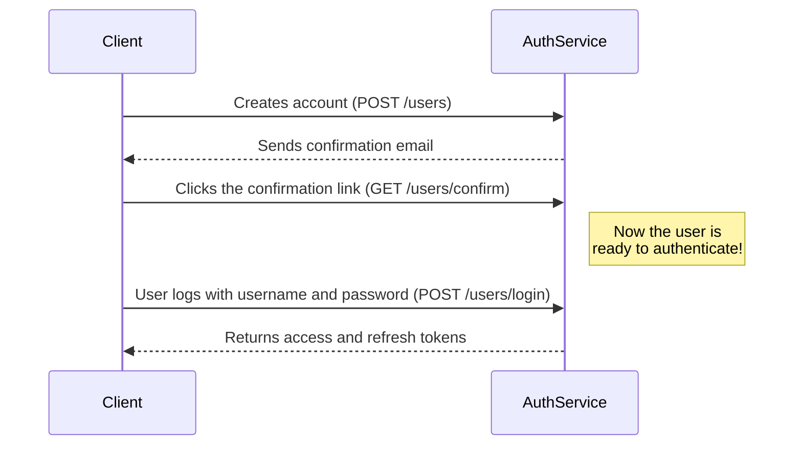
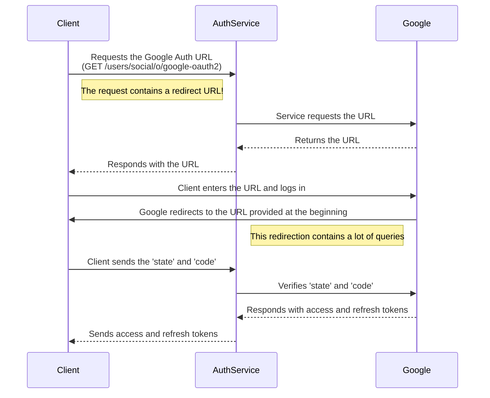

# Credentials and OAuth2 Authentication

ALeRCE has two ways of authenticating users, which are credentials login (or username-password) and OAuth2 using the Google API.
Both work differently, and it's important for developers to know how they work before implementing them in the different clients.

**Table of Contents**
- [Credentials Authentication](#credentials-authentication)
- [OAuth2 Authentication](#oauth2-authentication)

## Credentials Authentication
This one is quite intuitive. The user must previously have created an account in the ALeRCE users service. In that process, they must provide some information, like their email, full name and role in their institution, just to name a few. After that, the user will receive an email for account confirmation.
Followed the email instructions, the user will be able to get their authentication tokens using the username and password chosen during the registration process. Those tokens will be used to further authorization in other ALeRCE's services.

**Example of a authentication with credentials**

## OAuth2 Authentication
This one might be a little tricky! Instead of using username and password stored in the ALeRCE Authentication service, the user can use a Google Account to achieve the same goal. For that, the ALeRCE Authentication service will facilitate a Google OAuth2 path, that will (re)direct the user to the well-known Google login page (it won't happen if the user is already logged in with one -and just one- Google account). It's important to notice that this Google path requires a callback URL. This path will receive as query params a lot of info. The developer must use the *state* and *code* params from this query in the client side. After that, those parameters must be sent to the ALeRCE Authentication service to finish the process, that will end with the service returning a set of access and refresh tokens (that will work the same as the tokens in the previous section!)

**OAuth flow in ALeRCE**

Still a little lost? You can check the code examples in the next sections.